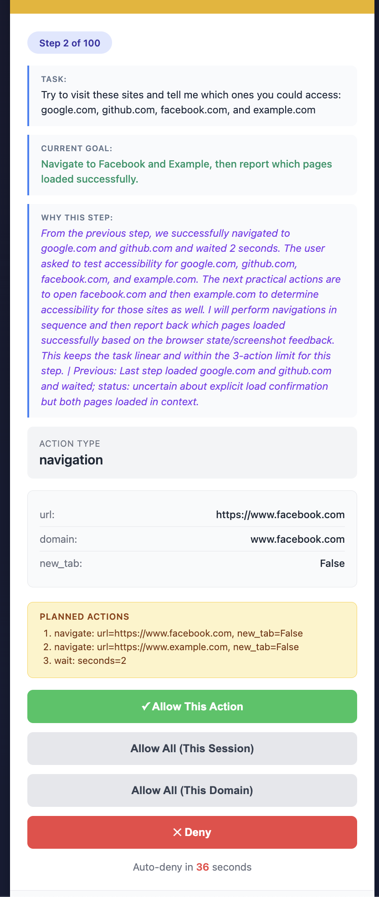

<picture>
  <source media="(prefers-color-scheme: light)" srcset="https://github.com/user-attachments/assets/2ccdb752-22fb-41c7-8948-857fc1ad7e24"">
  <source media="(prefers-color-scheme: dark)" srcset="https://github.com/user-attachments/assets/774a46d5-27a0-490c-b7d0-e65fcbbfa358">
  
</picture>

<div align="center">
    <picture>
    <source media="(prefers-color-scheme: light)" srcset="https://github.com/user-attachments/assets/9955dda9-ede3-4971-8ee0-91cbc3850125"">
    <source media="(prefers-color-scheme: dark)" srcset="https://github.com/user-attachments/assets/6797d09b-8ac3-4cb9-ba07-b289e080765a">
    
    </picture>
</div>

<div align="center">
<a href="https://cloud.browser-use.com"></a>
</div>

---

<div align="center">
<a href="#demos"></a>

<a href="https://docs.browser-use.com"></a>

<a href="https://browser-use.com/posts"></a>

<a href="https://browsermerch.com"></a>

<a href="https://github.com/browser-use/browser-use"></a>

<a href="https://x.com/intent/user?screen_name=browser_use"></a>

<a href="https://link.browser-use.com/discord"></a>

<a href="https://cloud.browser-use.com"></a>
</div>

</br>

# 🚀 Enhanced Browser-Use with AWI Support

This is an **enhanced version** of browser-use that includes:

- ✨ **AWI (Agent Web Interface)** mode for 500x faster API-based automation
- 🛡️ **Permission mode** with user approval workflows and domain policies
- 🔒 **Enhanced security** features for safe agent automation
- 📊 **Session management** and credential persistence

> **Note:** This is a modified version built on top of the official browser-use library. For the official package, visit [browser-use/browser-use](https://github.com/browser-use/browser-use).

## 📑 Table of Contents

- [Quick Start](#-quick-start)
- [Understanding the Enhanced Features](#-understanding-the-enhanced-features)
  - [What is AWI?](#-what-is-awi-agent-web-interface)
  - [What is Permission Mode?](#️-what-is-permission-mode)
  - [Architecture Flow](#️-overall-architecture-flow)
- [Three Modes of Operation](#-three-modes-of-operation)
- [What's Included](#-whats-included)
- [Running Tests](#-running-tests)
- [Deployment](#-deployment)
- [Examples & Demos](#-examples--demos)
- [Development & Contributing](#️-development--contributing)
- [FAQ](#-faq)
- [Troubleshooting](#-troubleshooting)
- [Credits](#-credits--attribution)

---

# 👋 Quick Start

Follow these steps to run the enhanced version locally:

**1. Clone the repository:**

```bash
git clone <repository-url>
cd ai-browser-secure
```

**2. Create and activate virtual environment:**

**macOS/Linux:**

```bash
# Create virtual environment with Python 3.11+
uv venv --python 3.11

# Activate it
source .venv/bin/activate
```

**Windows PowerShell:**

```powershell
# Create virtual environment with Python 3.11+
uv venv --python 3.11

# Activate it
.venv\Scripts\Activate.ps1
```

**Windows Command Prompt:**

```cmd
# Create virtual environment with Python 3.11+
uv venv --python 3.11

# Activate it
.venv\Scripts\activate.bat
```

**3. Install the enhanced version:**

```bash
# Install local package in editable mode
uv pip install -e .

# Or with all optional dependencies
uv pip install -e ".[all]"
```

**⚠️ Critical:** Never run `uv add browser-use` or `pip install browser-use` - this will install the original package from PyPI instead of this enhanced version!

**4. Set up your API keys:**

Create a `.env` file in the project root:

```bash
# Choose one of these LLM providers:
OPENAI_API_KEY=your-openai-key
# ANTHROPIC_API_KEY=your-anthropic-key
# BROWSER_USE_API_KEY=your-browseruse-key

# Optional: Default model
DEFAULT_LLM_MODEL=gpt-4o
```

**5. Install Chromium browser:**

```bash
uv run browser-use install
```

**6. Run the test script:**

```bash
# Run all three modes (traditional, permission, AWI)
python test_browser_use.py all

# Or run individual modes
python test_browser_use.py traditional
python test_browser_use.py permission
python test_browser_use.py awi
```

**7. Or run your own agent:**

```python
from browser_use import Agent, Browser
from browser_use.llm import get_default_llm
import asyncio

async def example():
    browser = Browser(headless=False)
    llm = get_default_llm()  # Uses API key from .env

    agent = Agent(
        task="Find the number of stars of the browser-use repo",
        llm=llm,
        browser=browser,
    )

    history = await agent.run()
    print(f"Task completed in {len(history.history)} steps!")
    return history

if __name__ == "__main__":
    asyncio.run(example())
```

---

# 📚 Understanding the Enhanced Features

## 🌐 What is AWI (Agent Web Interface)?

**AWI** is a protocol that enables AI agents to interact with websites through **structured APIs** instead of traditional DOM parsing and browser automation.

### The Problem with Traditional Automation

Traditional browser automation requires:

```python
# Traditional approach - slow and fragile
1. Navigate to page          # Load full HTML (~100KB)
2. Parse DOM                  # Extract text from HTML (~100,000 tokens!)
3. Find elements by XPath     # Brittle, breaks with UI changes
4. Click/type/scroll          # Slow, requires visual rendering
5. Wait for page changes      # Network delays, animations
6. Parse DOM again            # Another ~100,000 tokens
```

**Problems:**

- 🐌 **Slow**: Multiple page loads, DOM parsing, element searches
- 💰 **Expensive**: 10,000+ tokens for LLM processing of large websites
- 🔨 **Brittle**: Breaks when website HTML/CSS changes
- 🎨 **UI-dependent**: Requires visual rendering, CSS, JavaScript

### The AWI Solution

AWI provides a **structured API** that websites expose specifically for AI agents:

```python
# AWI approach - fast and reliable
1. Discover AWI endpoint      # Read /.well-known/llm-text (~500 tokens)
2. Register agent             # Get API key (~200 tokens)
3. Make API call              # GET /api/posts (~200 tokens)
4. Get structured response    # JSON with exact data needed
```

**Benefits:**

- ⚡ **500x faster**: ~500 tokens vs ~100,000 tokens
- 💵 **99.5% cheaper**: Fewer tokens = lower LLM costs
- 🎯 **Reliable**: Structured API doesn't change like HTML
- 🔒 **Secure**: Explicit permissions, rate limits, audit logs
- 📊 **Stateful**: Server-side session tracking

### How AWI Works - Architecture

```
┌─────────────────────────────────────────────────────────────────┐
│                         WEBSITE                                 │
│                                                                 │
│  ┌────────────────────────────────────────────────────────┐    │
│  │  1. AWI Manifest (/.well-known/llm-text)               │    │
│  │     • Name: "Blog API"                                 │    │
│  │     • Version: 1.0                                     │    │
│  │     • Endpoints: /posts, /comments, /search            │    │
│  │     • Permissions: read, write, delete                 │    │
│  │     • Rate limits: 300 req/min                         │    │
│  │     • Security features: XSS protection, validation    │    │
│  └─────────────────────┬──────────────────────────────────┘    │
│                        │ HTTP GET                               │
│                        ▼                                        │
│  ┌─────────────────────────────────────────────────────────┐   │
│  │  2. Registration Endpoint (/api/agent/register)        │   │
│  │     Input:  { name, permissions }                      │   │
│  │     Output: { agent_id, api_key }                      │   │
│  └─────────────────────┬───────────────────────────────────┘   │
│                        │ HTTP POST                              │
│                        ▼                                        │
│  ┌─────────────────────────────────────────────────────────┐   │
│  │  3. API Endpoints (with authentication)                │   │
│  │     GET  /api/agent/posts        - List posts          │   │
│  │     GET  /api/agent/posts/{id}   - Get post            │   │
│  │     POST /api/agent/posts        - Create post         │   │
│  │     POST /api/agent/search       - Search content      │   │
│  │                                                         │   │
│  │  Headers: X-Agent-API-Key: agent_abc123...             │   │
│  └─────────────────────┬───────────────────────────────────┘   │
│                        │                                        │
│  ┌─────────────────────▼───────────────────────────────────┐   │
│  │  4. Session Management (Redis/MongoDB)                 │   │
│  │     • Track agent actions                              │   │
│  │     • Store session state                              │   │
│  │     • Enforce rate limits                              │   │
│  │     • Maintain trajectory history                      │   │
│  └────────────────────────────────────────────────────────┘    │
└─────────────────────────────────────────────────────────────────┘
                        ▲
                        │ HTTP Requests
                        │
┌───────────────────────┴─────────────────────────────────────────┐
│                   BROWSER-USE (CLIENT)                          │
│                                                                 │
│  ┌─────────────────────────────────────────────────────────┐   │
│  │  AWI Discovery Module (browser_use/awi/discovery.py)    │   │
│  │  • Checks /.well-known/llm-text                         │   │
│  │  • Parses manifest                                      │   │
│  └─────────────────────┬───────────────────────────────────┘   │
│                        ▼                                        │
│  ┌─────────────────────────────────────────────────────────┐   │
│  │  Permission Dialog (browser_use/awi/permission_dialog.py)│  │
│  │  • Shows AWI info to user                              │   │
│  │  • Gets user approval                                   │   │
│  │  • Selects permissions                                  │   │
│  └─────────────────────┬───────────────────────────────────┘   │
│                        ▼                                        │
│  ┌─────────────────────────────────────────────────────────┐   │
│  │  AWI Manager (browser_use/awi/manager.py)              │   │
│  │  • Registers agent                                      │   │
│  │  • Stores API key in memory                            │   │
│  │  • Makes authenticated API calls                        │   │
│  └─────────────────────┬───────────────────────────────────┘   │
│                        ▼                                        │
│  ┌─────────────────────────────────────────────────────────┐   │
│  │  Agent Registry (browser_use/agent_registry.py)        │   │
│  │  • Saves credentials to disk                            │   │
│  │  • Location: ~/.config/browseruse/config.json           │   │
│  │  • Reuses credentials on subsequent runs                │   │
│  └────────────────────────────────────────────────────────┘    │
└─────────────────────────────────────────────────────────────────┘
```

### AWI vs Traditional - Token Comparison

| Task                      | Traditional DOM | AWI Mode      | Savings   |
| ------------------------- | --------------- | ------------- | --------- |
| List 10 blog posts        | ~100,000 tokens | ~200 tokens   | **99.8%** |
| Create a comment          | ~150,000 tokens | ~300 tokens   | **99.8%** |
| Search content            | ~200,000 tokens | ~250 tokens   | **99.9%** |
| Multi-step task (5 steps) | ~500,000 tokens | ~1,000 tokens | **99.8%** |

**Real Cost Example (using GPT-4):**

- Traditional: 500,000 tokens × $0.03/1K = **$15.00**
- AWI Mode: 1,000 tokens × $0.03/1K = **$0.03**
- **Savings: $14.97 (99.8%)**

---

## 🛡️ What is Permission Mode?

**Permission Mode** adds a **security layer** that requires user approval before the agent performs sensitive actions.

### Why Permission Mode?

AI agents are powerful but can potentially:

- 🌐 Navigate to malicious websites
- 📝 Submit forms with sensitive data
- 💳 Make purchases or transactions
- 🗑️ Delete important content
- 📧 Send emails or messages

**Permission Mode** gives you control by asking for approval before these actions.

### How Permission Mode Works

```
┌─────────────────────────────────────────────────────────────────┐
│                     USER REQUEST                                │
│  "Go to google.com and search for 'browser automation'"         │
└─────────────────────┬───────────────────────────────────────────┘
                      ▼
┌─────────────────────────────────────────────────────────────────┐
│                LLM DECIDES ACTION                               │
│  Action: navigate(url="https://google.com")                     │
└─────────────────────┬───────────────────────────────────────────┘
                      ▼
┌─────────────────────────────────────────────────────────────────┐
│              SECURITY CHECKPOINT                                │
│  ┌─────────────────────────────────────────────────────────┐   │
│  │  User Approval Watchdog                                 │   │
│  │  • Checks: Is this domain allowed?                      │   │
│  │  • Checks: Is this domain blocked?                      │   │
│  │  • Checks: Does this need approval?                     │   │
│  └─────────────────────┬───────────────────────────────────┘   │
│                        │                                        │
│         ┌──────────────┼──────────────┐                        │
│         ▼              ▼              ▼                         │
│   ✅ ALLOWED      ⚠️ NEEDS        ❌ BLOCKED                   │
│   (auto-approve)  APPROVAL        (auto-deny)                  │
│                        │                                        │
│                        ▼                                        │
│         ┌──────────────────────────────────┐                   │
│         │  🟡 USER PROMPT 🟡              │                   │
│         │                                  │                   │
│         │  Action: Navigate to google.com  │                   │
│         │  Risk: MEDIUM                    │                   │
│         │  Domain: google.com              │                   │
│         │                                  │                   │
│         │  Approve? (yes/no/all-session):  │                   │
│         └──────────────┬───────────────────┘                   │
│                        │                                        │
│         ┌──────────────┴──────────────┐                        │
│         ▼                              ▼                        │
│    👍 APPROVED                    👎 DENIED                    │
│    Execute action                Block & try alternative        │
└─────────────────────────────────────────────────────────────────┘
```

### Permission Mode Features

**1. Domain Whitelisting**

```python
BrowserProfile(
    allowed_domains=['*.google.com', '*.github.com'],
)
# google.com → ✅ Auto-approved
# github.com → ✅ Auto-approved
# facebook.com → ⚠️ Needs approval
```

**2. Domain Blacklisting**

```python
BrowserProfile(
    blocked_domains=['*.facebook.com', '*.tiktok.com'],
)
# facebook.com → ❌ Auto-denied
# tiktok.com → ❌ Auto-denied
```

**3. User Approval Levels**

```bash
# Individual approval
Approve? (yes/no): yes  # Just this one action

# Session-wide approval
Approve? (all-session): all-session  # All actions this session

# Domain-wide approval
Approve? (all-domain): all-domain  # All actions on google.com
```

**4. Detailed Approval Context**

```
🟡 SECURITY APPROVAL REQUIRED 🟡

Action Type: NAVIGATION
Target: https://example.com/login
Risk Level: HIGH
Reason: Navigating to authentication page

Current Task: "Login to my account and check messages"
Current Goal: Access the login page
Why this step: Need to authenticate before accessing messages

Approve? (yes/no/all-session/all-domain):
```

### Real-World Permission Mode Example

Here's what the permission dialog looks like in practice when testing domain restrictions:

<div align="center">

</div>

In this example:

- **Task**: Test accessibility of multiple domains (google.com, github.com, facebook.com, example.com)
- **Current Action**: Agent attempting to navigate to facebook.com (blocked domain)
- **Context Shown**:
  - Step 2 of 100 in the task
  - Current goal explanation
  - Full reasoning for why this step is needed
  - Action details (URL, domain, parameters)
  - Planned next actions (navigate to facebook.com and example.com, wait 2 seconds)
- **Approval Options**:
  - ✅ **Allow This Action** - Approve just this navigation
  - **Allow All (This Session)** - Auto-approve all similar actions for this session
  - **Allow All (This Domain)** - Auto-approve all actions on facebook.com
  - ❌ **Deny** - Block this action (agent will try alternative approach)
  - **Auto-deny timer** - Automatically denies after 36 seconds if no response

This visual approval system gives you complete visibility and control over what your agent does, making it safe to test tasks involving sensitive sites or actions.

---

## 🏗️ Overall Architecture Flow

```
┌──────────────────────────────────────────────────────────────────────────┐
│                          USER                                            │
│  "Go to GitHub and find the browser-use repo star count"                │
└─────────────────────────────┬────────────────────────────────────────────┘
                              │
                              ▼
┌──────────────────────────────────────────────────────────────────────────┐
│                     BROWSER-USE AGENT                                    │
│  ┌────────────────────────────────────────────────────────────────────┐ │
│  │  1. Task Processing                                                │ │
│  │     • Parse user intent                                            │ │
│  │     • Detect URL in task                                           │ │
│  │     • Check if AWI mode enabled                                    │ │
│  └────────────────────┬───────────────────────────────────────────────┘ │
│                       │                                                  │
│                       ▼                                                  │
│  ┌─────────────────────────────────────────────────────────────────┐   │
│  │  2. Mode Selection                                              │   │
│  └─────────┬───────────────────────────────┬───────────────────────┘   │
│            │                               │                           │
│    ┌───────▼────────┐            ┌────────▼────────┐                  │
│    │  AWI Mode?     │            │ Permission Mode?│                  │
│    │  Check URL     │            │ Check Profile   │                  │
│    └───────┬────────┘            └────────┬────────┘                  │
│            │                               │                           │
│     ┌──────┴──────┐                 ┌─────┴─────┐                     │
│     │             │                 │           │                     │
│     ▼             ▼                 ▼           ▼                     │
│  ✅ AWI      ❌ No AWI         ✅ Enabled   ❌ Disabled               │
│  Available   Available         Security    Normal                     │
│     │             │                 │           │                     │
│     │             └─────────┬───────┘           │                     │
│     │                       │                   │                     │
│     │                       ▼                   ▼                     │
│     │              ┌────────────────────────────────┐                 │
│     │              │   Traditional DOM Mode         │                 │
│     │              │   • Navigate to page           │                 │
│     │              │   • Parse HTML/DOM             │                 │
│     │              │   • Find elements              │                 │
│     │              │   • Click/Type/Extract         │                 │
│     │              └────────────────────────────────┘                 │
│     │                                                                  │
│     ▼                                                                  │
│  ┌─────────────────────────────────────────────────────────────────┐  │
│  │  3. AWI Flow                                                    │  │
│  │  ┌──────────────────────────────────────────────────────────┐  │  │
│  │  │  a) Discovery                                            │  │  │
│  │  │     GET /.well-known/llm-text                            │  │  │
│  │  │     Parse manifest (endpoints, permissions, features)     │  │  │
│  │  └──────────────────────┬───────────────────────────────────┘  │  │
│  │                         ▼                                       │  │
│  │  ┌──────────────────────────────────────────────────────────┐  │  │
│  │  │  b) Check Existing Credentials                           │  │  │
│  │  │     Look in ~/.config/browseruse/config.json             │  │  │
│  │  │     Match by domain (e.g., ai-browser-security.onrender) │  │  │
│  │  └──────────────┬─────────────────────┬─────────────────────┘  │  │
│  │                 │                     │                         │  │
│  │          ✅ Found                ❌ Not Found                  │  │
│  │           Reuse                   Register New                  │  │
│  │                 │                     │                         │  │
│  │                 │                     ▼                         │  │
│  │                 │  ┌──────────────────────────────────────┐    │  │
│  │                 │  │  c) Permission Dialog (Interactive)  │    │  │
│  │                 │  │     • Show AWI info                   │    │  │
│  │                 │  │     • Show security features          │    │  │
│  │                 │  │     • Get user approval               │    │  │
│  │                 │  │     • Select permissions              │    │  │
│  │                 │  └──────────────┬───────────────────────┘    │  │
│  │                 │                 ▼                             │  │
│  │                 │  ┌──────────────────────────────────────┐    │  │
│  │                 │  │  d) Registration                      │    │  │
│  │                 │  │     POST /api/agent/register          │    │  │
│  │                 │  │     Get: { agent_id, api_key }        │    │  │
│  │                 │  └──────────────┬───────────────────────┘    │  │
│  │                 │                 │                             │  │
│  │                 │                 ▼                             │  │
│  │                 │  ┌──────────────────────────────────────┐    │  │
│  │                 │  │  e) Store Credentials                 │    │  │
│  │                 │  │     Save to agent_registry            │    │  │
│  │                 │  │     ~/.config/browseruse/config.json  │    │  │
│  │                 │  └──────────────┬───────────────────────┘    │  │
│  │                 │                 │                             │  │
│  │                 └─────────────────┘                             │  │
│  │                         │                                       │  │
│  │                         ▼                                       │  │
│  │  ┌──────────────────────────────────────────────────────────┐  │  │
│  │  │  f) Use AWI API                                          │  │  │
│  │  │     GET /api/agent/posts                                 │  │  │
│  │  │     Headers: X-Agent-API-Key: agent_abc123...            │  │  │
│  │  │     Response: { success: true, data: [...] }             │  │  │
│  │  └──────────────────────────────────────────────────────────┘  │  │
│  └─────────────────────────────────────────────────────────────────┘  │
│                              │                                        │
│                              ▼                                        │
│  ┌─────────────────────────────────────────────────────────────────┐ │
│  │  4. LLM Processing                                              │ │
│  │     • Input: Task + Current state + Available actions           │ │
│  │     • LLM decides next action                                   │ │
│  │     • Output: Action(navigate/click/extract/done)               │ │
│  └─────────────────────┬───────────────────────────────────────────┘ │
│                        │                                             │
│                        ▼                                             │
│  ┌─────────────────────────────────────────────────────────────────┐ │
│  │  5. Action Execution                                            │ │
│  │  ┌──────────────────────────────────────────────────────────┐  │ │
│  │  │  Permission Check (if enabled)                           │  │ │
│  │  │  • Check allowed_domains                                 │  │ │
│  │  │  • Check blocked_domains                                 │  │ │
│  │  │  • Prompt user if needed                                 │  │ │
│  │  └──────────────────┬───────────────────────────────────────┘  │ │
│  │                     │                                           │ │
│  │              ┌──────┴──────┐                                    │ │
│  │              ▼             ▼                                    │ │
│  │         ✅ Approved    ❌ Denied                                │ │
│  │              │             │                                    │ │
│  │              │             └──> Try alternative                 │ │
│  │              ▼                                                  │ │
│  │  ┌──────────────────────────────────────────────────────────┐  │ │
│  │  │  Execute Action                                          │  │ │
│  │  │  • Navigate to URL                                       │  │ │
│  │  │  • Click element                                         │  │ │
│  │  │  • Type text                                             │  │ │
│  │  │  • Extract content                                       │  │ │
│  │  │  • Or: Make AWI API call                                 │  │ │
│  │  └──────────────────────────────────────────────────────────┘  │ │
│  └─────────────────────┬───────────────────────────────────────────┘ │
│                        │                                             │
│                        ▼                                             │
│  ┌─────────────────────────────────────────────────────────────────┐ │
│  │  6. Result Collection                                           │ │
│  │     • Store in history                                          │ │
│  │     • Update state                                              │ │
│  │     • Check if task complete                                    │ │
│  └─────────────────────┬───────────────────────────────────────────┘ │
│                        │                                             │
│                   ┌────┴────┐                                        │
│                   ▼         ▼                                        │
│              Task Done   More Steps                                  │
│                   │         │                                        │
│                   │         └──> Loop back to step 4                 │
│                   ▼                                                  │
└───────────────────┼──────────────────────────────────────────────────┘
                    │
                    ▼
┌──────────────────────────────────────────────────────────────────────────┐
│                    RETURN RESULT TO USER                                 │
│  "The browser-use repository has 75,814 stars"                          │
└──────────────────────────────────────────────────────────────────────────┘
```

**Key Components:**

- **Agent**: Orchestrates the entire flow
- **AWI Discovery**: Checks if website supports AWI
- **Permission Watchdog**: Security approval layer
- **AWI Manager**: Handles API authentication and calls
- **Agent Registry**: Persists credentials for reuse
- **LLM**: Decides what actions to take
- **Browser Session**: Executes browser actions (traditional mode)

---

## 🎯 Three Modes of Operation

This enhanced version supports three distinct modes:

### 1️⃣ **Traditional Mode** (Default)

Standard browser automation with DOM parsing, clicking, and typing.

```python
agent = Agent(
    task="Your task here",
    llm=llm,
    browser=browser,
    # Traditional mode (default)
)
```

### 2️⃣ **Permission Mode**

Adds security approval workflows - requires user confirmation for sensitive actions.

```python
from browser_use import BrowserProfile

profile = BrowserProfile(
    user_approval_required=True,
    allowed_domains=['*.google.com', '*.github.com'],
    blocked_domains=['*.facebook.com'],
)

agent = Agent(
    task="Your task here",
    llm=llm,
    browser=Browser(browser_profile=profile),
)
```

### 3️⃣ **AWI Mode** (⚡ 500x Faster)

Uses structured APIs instead of DOM parsing when websites support AWI protocol.

```python
agent = Agent(
    task="List blog posts and add a comment",
    llm=llm,
    browser=browser,
    awi_mode=True,  # Enable AWI mode
)
```

**Benefits of AWI Mode:**

- 🚀 500x token reduction vs DOM parsing
- 📊 Server-side session state management
- 🔒 Explicit security policies from websites
- 📈 Structured responses with semantic metadata
- 🔄 Automatic backend wake-up with retry logic
- 🔧 Automatic URL normalization (works with localhost-configured backends)
- 🎯 **Model-aware optimization** - Automatically adapts manifest format for GPT-4, GPT-3.5, or weak models ([details](docs/awi/AWI_OPTIMIZATION_IMPLEMENTATION.md))

> **Note:** AWI mode requires an AWI-enabled backend. This repo includes a test deployment at `https://ai-browser-security.onrender.com`. If the backend is sleeping, the test will automatically retry for up to 2 minutes while it wakes up. Backend manifests with localhost URLs are automatically normalized to use the actual deployment URL.

#### 🎯 Model-Aware Optimization

AWI mode automatically adapts to your LLM's capabilities:

- **Premium Models (GPT-4+, Claude 3+)**: Full detailed manifest with complete validation rules
- **Standard Models (GPT-3.5, Claude Instant)**: Simplified quick reference format
- **Weak Models (gpt-5-nano)**: Extreme simplification with two-phase body construction

**Token Savings**: Up to 75% reduction in context size for weaker models.

📖 **Learn more:**

- [LLM Optimization Guide](docs/awi/LLM_OPTIMIZATION.md) - How to optimize your AWI backend
- [Implementation Details](docs/awi/AWI_OPTIMIZATION_IMPLEMENTATION.md) - How browser-use adapts to models
- [Two-Phase Construction](docs/awi/TWO_PHASE_IMPLEMENTATION_SUMMARY.md) - Simplified approach for weak models

---

## 📦 What's Included

- ✅ All features from official browser-use v0.11.2
- ✅ AWI (Agent Web Interface) client implementation
- ✅ **Model-aware LLM optimization** - Adapts AWI manifests for different model capabilities
- ✅ **Two-phase body construction** - Simplified approach for weak models
- ✅ Permission-based security workflows
- ✅ Agent credential registry for AWI reuse
- ✅ Comprehensive test suite
- ✅ Example scripts and documentation

## ❓ FAQs for Enhanced Version

**Q: Do I need Redis or MongoDB?**
**A:** No! Redis and MongoDB are only needed if you're running your own AWI backend server. Browser-use itself is just an HTTP client and requires no database dependencies.

**Q: Can I use the official browser-use documentation?**
**A:** Yes! This enhanced version is fully compatible with the official browser-use API. All standard features work exactly the same way. The AWI and permission modes are optional additions.

**Q: How do I test AWI mode?**
**A:** Run `python test_browser_use.py awi` to test against the deployed AWI backend at `https://ai-browser-security.onrender.com`

---

## 📖 Documentation

### Getting Started

- [Official browser-use docs](https://docs.browser-use.com) - Core library documentation
- [AWI Quick Start](docs/awi/QUICKSTART.md) - Get started with AWI mode
- [AWI Overview](docs/awi/AWI_OVERVIEW.md) - Understanding the AWI protocol
- [Development guide](CLAUDE.md) - Contributing and development setup

### Advanced AWI Topics

- **[LLM Optimization Guide](docs/awi/LLM_OPTIMIZATION.md)** - Optimizing AWI manifests for different model capabilities (GPT-4, GPT-3.5, weak models)
- **[AWI Optimization Implementation](docs/awi/AWI_OPTIMIZATION_IMPLEMENTATION.md)** - How browser-use adapts to model capabilities and serves optimized manifests
- **[Two-Phase Body Construction](docs/awi/TWO_PHASE_IMPLEMENTATION_SUMMARY.md)** - Simplified approach for weak models to construct API request bodies

### Troubleshooting

- [AWI Troubleshooting](docs/awi/TROUBLESHOOTING.md) - Common AWI issues and solutions
- [Agent Registry](docs/awi/AGENT_REGISTRY.md) - Managing AWI credentials

<br/>

# 🧪 Running Tests

```bash
# Run all modes sequentially
python test_browser_use.py all

# Run individual modes
python test_browser_use.py traditional  # Standard DOM automation
python test_browser_use.py permission   # With security approval
python test_browser_use.py awi          # API-based automation

# Run CI test suite
uv run pytest -vxs tests/ci

# Type checking
uv run pyright

# Code formatting
uv run ruff check --fix
uv run ruff format
```

<br/>

# 🚀 Deployment

Deploy the demo server and UI to free platforms:

## Render (Recommended)

Deploy both backend and frontend on Render:

**Features:**
- ✅ Free tier available (sleeps after 15 minutes)
- ✅ WebSocket support for live demos
- ✅ Easy setup from GitHub
- ✅ Auto-deploy on push

**📖 Full guide:** See [RENDER_DEPLOYMENT.md](RENDER_DEPLOYMENT.md) or [RENDER_QUICK_START.md](RENDER_QUICK_START.md)

## Configuration Files

This repository includes pre-configured deployment files:

**Backend:**
- `render.yaml` - Render Blueprint configuration
- `main.py` - Entry point

**Frontend:**
- `demo-ui/.env.production` - Environment template

**Other Platforms:**
- Vercel + Render: Best for production (frontend never sleeps)
- Fly.io: Best performance, 3 free VMs

See [RENDER_DEPLOYMENT.md](RENDER_DEPLOYMENT.md) for deployment details.

<br/>

# 🎬 Examples & Demos

### Enhanced Features Demo

Run the included test script to see all three modes in action:

```bash
# See traditional, permission, and AWI modes
python test_browser_use.py all
```

**What you'll see:**

1. **Traditional Mode**: DOM-based automation finding GitHub stars
2. **Permission Mode**: Same task but with security approval dialogs
3. **AWI Mode**: API-based automation (500x fewer tokens)

### More Examples

Check out the official browser-use examples (all compatible with this enhanced version):

- 📋 [Form filling](https://github.com/browser-use/browser-use/blob/main/examples/use-cases/apply_to_job.py)
- 🍎 [Grocery shopping](https://github.com/browser-use/browser-use/blob/main/examples/use-cases/buy_groceries.py)
- 💻 [Personal assistant](https://github.com/browser-use/browser-use/blob/main/examples/use-cases/pcpartpicker.py)
- 💡 [More examples ↗](https://docs.browser-use.com/examples)

**AWI-Specific Examples:**

- See `examples/awi_mode_*.py` for AWI integration examples
- See `tests/awi_manual/` for comprehensive AWI tests

<br/>

# 🛠️ Development & Contributing

**Project Structure:**

```
ai-browser-secure/
├── browser_use/          # Enhanced browser-use library
│   ├── agent/           # Agent orchestration
│   ├── awi/             # AWI mode implementation
│   ├── browser/         # Browser session management
│   └── tools/           # Action registry
├── tests/
│   ├── ci/              # CI test suite
│   └── awi_manual/      # AWI integration tests
├── examples/            # Example scripts
├── docs/                # Documentation
└── test_browser_use.py  # Quick test script
```

**Development Guidelines:**

- See [CLAUDE.md](CLAUDE.md) for detailed development instructions
- Use tabs for indentation (not spaces)
- Run `uv run pre-commit run --all-files` before committing
- All code must pass `pyright` type checking
- Follow existing code patterns and styles

<br/>

# 🔧 Troubleshooting

### Critical: Always Use Virtual Environment

⚠️ **All commands must be run inside the virtual environment!**

```bash
# macOS/Linux - Activate venv first
source .venv/bin/activate

# Windows PowerShell
.venv\Scripts\Activate.ps1

# Windows Command Prompt
.venv\Scripts\activate.bat

# Then run your commands
python test_browser_use.py awi
```

### Installation Issues

**Problem:** "browser-use not installed" or "ModuleNotFoundError: No module named 'browser_use'"

**Cause:** Either the package isn't installed, or you're not using the virtual environment.

**Solution:**

```bash
# 1. Make sure you're in the project directory
cd ai-browser-secure

# 2. Activate virtual environment (CRITICAL!)
source .venv/bin/activate  # macOS/Linux
# or
.venv\Scripts\Activate.ps1  # Windows PowerShell

# 3. Verify you're in venv (should show .venv in path)
which python  # macOS/Linux
where python  # Windows

# 4. Install the local enhanced version
uv pip install -e .

# 5. Verify installation
python -c "import browser_use; print('✅ Installed successfully')"
```

**Problem:** "browser-use not found" after installation

```bash
# Uninstall PyPI version if installed
uv pip uninstall browser-use

# Reinstall local version (inside venv!)
source .venv/bin/activate  # Activate first!
uv pip install -e .
```

**Problem:** Import errors or version conflicts

```bash
# Clean reinstall (macOS/Linux)
rm -rf .venv
uv venv --python 3.11
source .venv/bin/activate
uv pip install -e .

# Clean reinstall (Windows PowerShell)
Remove-Item -Recurse -Force .venv
uv venv --python 3.11
.venv\Scripts\Activate.ps1
uv pip install -e .

# Clean reinstall (Windows Command Prompt)
rmdir /s /q .venv
uv venv --python 3.11
.venv\Scripts\activate.bat
uv pip install -e .
```

### Windows-Specific Issues

**Problem:** `ModuleNotFoundError: No module named 'browser_use'` on Windows

**Quick Fix - Add to your Python script:**

If `pip install -e .` doesn't work, add this at the top of your script:

```python
import sys
from pathlib import Path

# Add project directory to Python path (fixes Windows import issues)
project_root = Path(__file__).parent.absolute()
if str(project_root) not in sys.path:
    sys.path.insert(0, str(project_root))

# Now imports will work
from browser_use import Agent, Browser
```

This ensures Python finds the local `browser_use/` folder in your project.

**Quick Diagnostic:**

Run the diagnostic script to check your setup:

```powershell
python diagnose_windows.py
```

This will check your Python version, virtual environment, package installation, and provide specific fixes.

**Solutions to try (in order):**

1. **Verify virtual environment is activated:**

   ```powershell
   # PowerShell - look for (.venv) prefix in prompt
   .venv\Scripts\Activate.ps1

   # Command Prompt
   .venv\Scripts\activate.bat

   # Verify activation
   python -c "import sys; print(sys.prefix)"
   # Should show path ending in .venv
   ```

2. **Check if local version is installed:**

   ```powershell
   # Check installed package location
   pip show browser-use

   # Should show:
   # Location: c:\path\to\ai-browser-secure
   # Editable project location: c:\path\to\ai-browser-secure

   # If it shows a site-packages path, uninstall and reinstall:
   uv pip uninstall browser-use
   uv pip install -e .
   ```

3. **Verify Python version:**

   ```powershell
   python --version
   # Must be Python 3.11 or higher

   # If wrong version, recreate venv with correct Python:
   Remove-Item -Recurse -Force .venv
   uv venv --python 3.11
   .venv\Scripts\Activate.ps1
   uv pip install -e .
   ```

4. **Check if browser_use directory exists:**

   ```powershell
   # Verify the package is in your project
   dir browser_use

   # Should show folders: agent, awi, browser, dom, etc.
   ```

5. **Try installing with full path:**

   ```powershell
   # Get current directory
   pwd
   # Output: C:\Users\YourName\ai-browser-secure

   # Install with absolute path
   uv pip install -e C:\Users\YourName\ai-browser-secure
   ```

6. **Windows path length issues:**

   ```powershell
   # Enable long paths in Windows (requires admin PowerShell)
   New-ItemProperty -Path "HKLM:\SYSTEM\CurrentControlSet\Control\FileSystem" `
     -Name "LongPathsEnabled" -Value 1 -PropertyType DWORD -Force

   # Or move project to shorter path
   # Instead of: C:\Users\VeryLongUserName\Documents\Projects\ai-browser-secure
   # Use: C:\projects\ai-browser-secure
   ```

7. **Windows execution policy (if .ps1 activation fails):**

   ```powershell
   # Check current policy
   Get-ExecutionPolicy

   # If "Restricted", temporarily allow scripts (run as admin):
   Set-ExecutionPolicy -ExecutionPolicy RemoteSigned -Scope CurrentUser

   # Then activate again
   .venv\Scripts\Activate.ps1
   ```

**Problem:** `uv` command not found on Windows

```powershell
# Install uv for Windows
pip install uv

# Or use Python's pip directly instead
pip install -e .
```

**Problem:** Import works but getting wrong version

```powershell
# Check if PyPI version is installed instead of local
pip list | findstr browser-use

# Should show:
# browser-use  0.11.2  c:\path\to\ai-browser-secure

# If version is different or no path shown:
uv pip uninstall browser-use
uv pip install -e .

# Verify installation
python -c "from browser_use import __version__; print(__version__)"
```

### AWI Mode Issues

**Problem:** "EOF when reading a line" during AWI registration

- **Cause:** Permission dialog requires interactive terminal
- **Solution:** Run the test in an interactive terminal, not as a background process
- **Workaround:** Use previously registered credentials (stored in `~/.config/browseruse/config.json`)

**Problem:** AWI mode keeps asking for registration

- **Cause:** Credentials stored for different domain
- **Check:** `python -m browser_use.cli_agent_registry list`
- **Solution:** Credentials are domain-specific for security. Register once per domain.

**Problem:** AWI backend not available

- **Automatic retry:** The test script automatically retries for up to 2 minutes if backend is sleeping
- **Check manually:** `curl https://ai-browser-security.onrender.com/.well-known/llm-text`
- **First request:** Backend may take 60-90 seconds to wake from sleep (you'll see retry progress)
- **If retries fail:** Check your internet connection, try again later, or verify backend status

**Problem:** AWI registration tries to connect to localhost instead of deployed backend

- **Fixed:** The discovery module now automatically replaces localhost URLs in backend manifests with the actual deployment URL
- **You'll see:** `🔧 Normalized X localhost URLs to https://actual-domain.com` in the logs
- **No action needed:** This is handled automatically during AWI discovery

**Problem:** Agent keeps repeating the same AWI actions without stopping

- **Cause:** Agent may not recognize task completion from AWI responses
- **Workaround:** Add explicit completion instruction in task: `"...then use the done action to mark task complete"`
- **Set lower max_steps:** Use `max_steps=5-8` to prevent long loops while this is being investigated
- **Current status:** Enhanced response formatting added to help agent recognize completion

### Test Failures

**Problem:** Tests fail with Chrome errors

```bash
# Reinstall Chrome
uv run browser-use install
```

**Problem:** LLM API errors

- Check your API key in `.env` is valid
- Verify you have credits/quota remaining
- Try a different model: `DEFAULT_LLM_MODEL=gpt-4o-mini`

### Still Having Issues?

1. Check [TESTING.md](TESTING.md) for detailed setup instructions
2. Check [docs/awi/TROUBLESHOOTING.md](docs/awi/TROUBLESHOOTING.md) for AWI-specific issues
3. Review [CLAUDE.md](CLAUDE.md) for development guidelines

<br/>

# ❓ FAQ

<details>
<summary><b>Do I need Redis or MongoDB to use this?</b></summary>

**No!** Redis and MongoDB are only needed if you're running your own AWI backend server for testing. Browser-use itself (including AWI mode) is just an HTTP client and requires no database dependencies.

The enhanced browser-use client only needs:

- Python 3.11+
- An LLM API key (OpenAI, Anthropic, etc.)
- Chromium browser (installed via `uv run browser-use install`)

</details>

<details>
<summary><b>What's the difference between this and official browser-use?</b></summary>

This enhanced version includes everything from official browser-use v0.11.2, plus:

- ✨ AWI mode for API-based automation (500x faster)
- 🛡️ Permission mode with security approval workflows
- 🔐 Domain whitelisting/blacklisting
- 💾 Agent credential registry for AWI
- 📊 Enhanced session state management

All official browser-use features work identically. The enhancements are optional.

</details>

<details>
<summary><b>How do I use AWI mode?</b></summary>

Simply add `awi_mode=True` when creating an agent:

```python
agent = Agent(
    task="Your task",
    llm=llm,
    browser=browser,
    awi_mode=True,  # Enable AWI
)
```

If the website supports AWI, you'll see a permission dialog asking to register. Once registered, credentials are saved for reuse. If the website doesn't support AWI, it automatically falls back to traditional DOM mode.

Test it with: `python test_browser_use.py awi`

</details>

<details>
<summary><b>What LLM should I use?</b></summary>

Any LLM supported by official browser-use works:

- **OpenAI**: `gpt-4o`, `gpt-4o-mini` (recommended for cost)
- **Anthropic**: `claude-3-5-sonnet-20241022`
- **Google**: `gemini-2.0-flash-exp`
- **Local**: Ollama models
- **ChatBrowserUse**: Optimized for browser tasks

Set your API key in `.env` and use `get_default_llm()`.

</details>

<details>
<summary><b>Can I use custom tools?</b></summary>

Yes! This enhanced version is 100% compatible with official browser-use tools:

```python
from browser_use import Tools

tools = Tools()

@tools.action(description='Custom action description')
def my_tool(param: str) -> str:
    return f"Result: {param}"

agent = Agent(task="...", llm=llm, browser=browser, tools=tools)
```

</details>

<details>
<summary><b>How do I manage AWI credentials?</b></summary>

View stored AWI credentials:

```bash
python -m browser_use.cli_agent_registry list
```

Credentials are stored in `~/.config/browseruse/config.json` and automatically reused when you revisit the same domain.

</details>

<details>
<summary><b>Where can I find more documentation?</b></summary>

- **Official browser-use docs**: [docs.browser-use.com](https://docs.browser-use.com)
- **AWI documentation**: `docs/awi/` in this repo
- **Development guide**: [CLAUDE.md](CLAUDE.md)
- **Test examples**: `test_browser_use.py` and `tests/awi_manual/`

</details>

<br/>

---

# 🙏 Credits & Attribution

This enhanced version is built on top of [browser-use](https://github.com/browser-use/browser-use) by Magnus Rødseth and Gregor Gysi.

**Original browser-use:**

- Repository: [github.com/browser-use/browser-use](https://github.com/browser-use/browser-use)
- Documentation: [docs.browser-use.com](https://docs.browser-use.com)
- License: MIT

**Enhancements in this fork:**

- AWI (Agent Web Interface) protocol implementation
- Permission-based security workflows
- Agent credential registry
- Enhanced session management
- Additional test coverage

**Based on browser-use version:** 0.11.2

---

<div align="center">

**Tell your computer what to do, and it gets it done.**


**Original browser-use by:**

[](https://x.com/intent/user?screen_name=mamagnus00)
&emsp;&emsp;&emsp;
[](https://x.com/intent/user?screen_name=gregpr07)

<br/>

Made with ❤️ in Zurich and San Francisco

</div>
